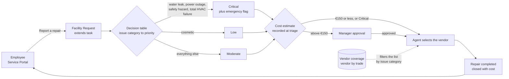

# Facilities & Maintenance Requests

A ServiceNow scoped application that takes office repair requests off email and chat. Employees report from the portal, the platform sets urgency and controls spend, vendors are routed by trade, and the manager gets a dashboard.

*The manager's dashboard — open requests, spend, and anything slipping.*

---

## Table of contents

- [The problem](#the-problem)
- [Screenshots](#screenshots)
- [Who uses it](#who-uses-it)
- [What it does](#what-it-does)
- [Design decisions](#design-decisions)
  - [The request table extends `task`, not `incident`](#the-request-table-extends-task-not-incident)
  - [Cost is estimated by the agent during triage, never by the employee](#cost-is-estimated-by-the-agent-during-triage-never-by-the-employee)
  - [Priority is derived from the issue category, and the requester cannot set it](#priority-is-derived-from-the-issue-category-and-the-requester-cannot-set-it)
  - [Vendors are selected through a coverage mapping, not a field on the vendor record](#vendors-are-selected-through-a-coverage-mapping-not-a-field-on-the-vendor-record)
  - [Ownership is a field default, not a routing rule](#ownership-is-a-field-default-not-a-routing-rule)
- [How it's built](#how-its-built)
  - [Request flow](#request-flow)
  - [Platform capabilities](#platform-capabilities)
  - [Data model](#data-model)
  - [Security](#security)
- [Tested with the Automated Test Framework](#tested-with-the-automated-test-framework)
- [Run it yourself](#run-it-yourself)
- [About](#about)

---

## The problem

Every office generates a stream of small facilities failures — a broken AC, a chair that collapsed,
a door that will not lock. Today they arrive by email or chat, which means:

- **The employee** who reports it hears nothing back, so the problem stays broken until someone
  complains twice.
- **The facilities team** has no queue, no priorities, and no record of what was fixed, by whom,
  or at what cost.
- **The manager** paying for the repairs cannot see what is broken, what it costs, or whether it
  was ever fixed.

This application puts that whole loop on the ServiceNow platform: self-service reporting from the
portal, rules that decide urgency and spend, vendor routing, and a status the requester can see.

---

## Screenshots

### The application menu

A scoped application with its own menu and modules, not a folder of loose records.

### Report a repair

How the employee reports a problem — no email, no chat, and nothing that needs chasing.

### Urgency, as a flow

The rule is a flow you can read at a glance rather than a script you have to trace.

### Urgency, as a decision table

The policy is a grid. Changing what counts as urgent is a data change, not a code change.

### The €150 approval

Above €150 the repair waits for the manager. Below it, nothing stops.

---

## Who uses it

Three roles, and each one is deliberately narrow.

| Persona | Can | Cannot |
|---|---|---|
| **Employee** — the requester | Report a repair from the portal; follow their own request as it moves received → in progress → done | See anyone else's request, mark their own request urgent, enter a cost estimate, or approve anything |
| **Facilities agent** — the operator | See every incoming request in one queue; triage it; record the cost estimate; select the vendor; update and close | Approve spend above the threshold |
| **Manager** — who pays for it | Approve costs above €150; see open work, spend, and anything slipping | Edit request records |

---

## What it does

- **Report a repair without email.** The employee describes the problem, picks the building, and
  gets a request number from the portal.
- **Urgency is decided by facts, not by whoever shouts loudest.** Water leaks, power outages, safety
  hazards, and total HVAC failures are flagged Critical automatically; cosmetic issues are Low;
  everything else sits in between. An agent can override the priority; the requester cannot raise
  their own.
- **Spend is controlled at €150.** The agent records the cost estimate during triage — the field is
  not editable for the requester. Up to €150 the repair proceeds; above it, work waits for the
  manager's approval. Critical requests skip approval and are flagged for later review.
- **Nothing can sit unassigned.** The facilities team owns every request from the moment it is
  created, so there is no state in which a request is invisible.
- **The right vendor is one click away.** A coverage mapping links each vendor to the trades they
  handle, and the vendor list is filtered to the request's issue category — so a multi-trade
  contractor is one record, not three, and the wrong pick is not on the list. Change the category
  and the form re-evaluates the selection rather than leaving the wrong trade in place.
- **The requester can see what is happening.** Status moves from received to in progress to done in
  the portal, with the requester's view limited to their own records.
- **The manager sees the whole picture.** Open requests, spend, and anything slipping.

---

## Design decisions

These are the choices that shaped the app. Every one of them was a fork in the road.

### The request table extends `task`, not `incident`

- **Decision** — a custom scoped table that extends Task.
- **Why** — Task already provides assignment, work notes, activity, priority, state, and approvals.
  Incident is built for IT incidents, so facilities work sitting on it would pollute IT reporting,
  and rebuilding what Task hands over for free would have produced a worse copy of a solved problem.

### Cost is estimated by the agent during triage, never by the employee

- **Decision** — the agent records the cost estimate during triage, and the amount decides whether a
  manager has to approve.
- **Why** — pricing a repair is expert input, and an untrusted number driving a money decision is
  worse than a short triage step. Approving every request would stall a €20 chair for days, and
  approving none would leave spend uncontrolled, so the €150 threshold splits the difference. The
  UI Policy enforces the rule at the form level so the field is out of reach rather than merely
  discouraged.

### Priority is derived from the issue category, and the requester cannot set it

- **Decision** — a decision table maps issue category to priority, called from a flow on insert and
  on category change. An agent can override; the employee cannot.
- **Why** — if requesters picked their own priority, every request would be urgent and priority
  would stop meaning anything. Deriving it from the category makes priority a fact about the broken
  thing rather than a feeling about it, and keeps the policy editable as a grid instead of buried in
  a script.

### Vendors are selected through a coverage mapping, not a field on the vendor record

- **Decision** — a `Vendor coverage` table with one row per vendor-and-trade pair, and a reference
  qualifier that filters the vendor field to the trades covering the request's issue category.
- **Why** — a real MEP contractor does plumbing, electrical, and HVAC, so the relationship is
  many-to-many. A single category column on the vendor record would force duplicate company records
  for a multi-trade contractor, which means the vendor master lies. This is the app's only custom
  table, because no baseline table maps vendors to trades and no field can hold "many". The cost is
  that per-vendor reporting walks through the coverage row — cheaper than a vendor master that
  cannot be trusted. A client script keeps the selected vendor consistent with the category when the
  category changes on the form.

### Ownership is a field default, not a routing rule

- **Decision** — the assignment group defaults to `Facilities Agents` when the request is created.
- **Why** — ownership of a facilities request is a constant: the team owns it from creation to
  close, so a routing rule would be machinery that can only ever produce one outcome. Expressing it
  as a field default makes "unassigned" structurally impossible rather than merely unlikely.

---

## How it's built

### Request flow

### Platform capabilities

| Platform capability | Where this app uses it |
|---|---|
| Scoped application | The whole app, under the scope `x_2025334_fac` — its own menu, roles, and source control |
| Studio source control | Every record version-controlled and exported to this repository |
| Record producer | The `Report a repair` intake form, on Service Portal and Employee Center |
| Flow Designer | The urgency rule on create and on category change, and the spend approval |
| Decision table | The category-to-priority policy, editable as a grid with no code change |
| Reference qualifier | Filters the vendor field to the vendors covering the request's issue category |
| UI Policy | Hides the cost estimate from the employee, so the field is editable only during agent triage |
| Client Script | Re-evaluates the vendor selection when the issue category changes, so the wrong trade cannot stay selected |
| Table ACLs | An employee reads only their own requests; an agent manages all; a manager reads and approves |
| Baseline approval engine | The manager approval created when an estimate crosses €150 |
| Table inheritance | The request extends Task, inheriting assignment, work notes, activity, priority, and state |
| Automated Test Framework | Eleven tests covering the rules above |

### Data model

| Record | Kind | Why it exists |
|---|---|---|
| Facility Request | custom, extends `task` | The request itself — inherits assignment, work notes, activity, priority, state, and approvals from Task instead of rebuilding them |
| Vendor coverage | custom | The app's only custom table: one row per vendor-and-trade pair, because a vendor covers many trades and no field holds "many" |
| Company | baseline `core_company` with the vendor flag | The vendor master. Not worth reinventing |
| Approval record | baseline | Created by the cost rule when the estimate crosses €150 |
| Decision table | baseline | The category-to-priority policy, editable as a grid with no code change |

### Security

Three roles map to the three personas. An employee reads only their own requests through an ACL on
the request table and cannot enter a cost estimate; an agent has full access; a manager reads and
approves but does not edit records. The employee role is granted through a `Facilities Employees`
group rather than assigned user by user, so onboarding stays a group operation and no ACL is written
per person.

---

## Tested with the Automated Test Framework

The core behaviours are covered by automated tests rather than by clicking through the app after
each change. Eleven tests stand behind the rules above.

| Test | What it proves |
|---|---|
| New request defaults to Open | The state loop starts in the right place |
| New request gets a priority | The urgency rule fires on insert |
| Updated request gets a priority | Priority is recomputed when the issue category changes |
| Critical request is flagged emergency-approved | Critical work skips spend approval and is queued for review |
| Approval is created above €150 | The cost threshold reaches the manager |
| No approval at or below €150 | Cheap repairs flow straight through |
| Every request is owned by the facilities team | Nothing is created unassigned |
| A selected vendor survives unrelated updates | Triage data is not clobbered by later edits |
| An employee cannot read another employee's request | The ACLs hold under impersonation |
| An employee cannot enter a cost estimate | The UI Policy holds the triage field out of the requester's reach |
| A rejected request closes incomplete | Rejection ends the loop instead of leaving it open |

---

## Run it yourself

You need a ServiceNow instance with admin rights — a free Personal Developer Instance is enough.

1. Import `dist/x_2025334_fac-<version>.xml` as an update set and commit it.
2. Create three test users and add them to the `Facilities Employees` group, the facilities agent
   group, and the manager role.
3. Open the portal and use **Report a repair** to submit a request — a water leak to see the
   urgency rule fire, or a €200 estimate to see the approval appear.
4. Run the ATF suite for the app to verify the rules on your instance.

> [!IMPORTANT]
> The application ships in the main update set. The tests ship in a second one, because ATF records
> live outside the app scope and the source-control export does not capture them.

---

## About

I'm **Jaime Rodríguez**, a ServiceNow developer — Certified System Administrator (CSA) and
Certified Application Developer (CAD).

[LinkedIn](https://www.linkedin.com/in/jaime2rodriguez) · Certifications, verified on Credly:
[CSA](https://www.credly.com/earner/earned/badge/7a8f5fbf-58e3-46e9-b983-286e801663d1) ·
[CAD](https://www.credly.com/earner/earned/badge/31d64862-a749-4bed-a13d-87423a0ec6ca)
